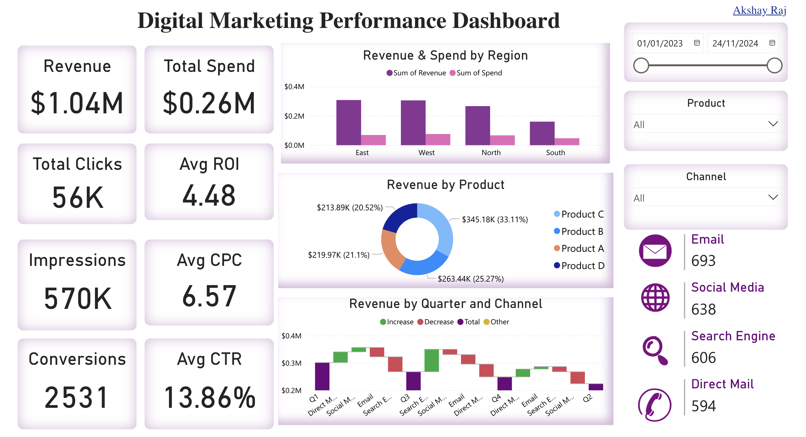

# 📊 Digital Marketing Performance Analysis

## 📌 Project Overview

Marketing analytics plays a crucial role in measuring the effectiveness of advertising campaigns, optimizing marketing spend, and improving customer engagement. This project provides a **data-driven analysis of digital marketing performance**, focusing on key metrics such as **click-through rates (CTR), conversions, return on investment (ROI), customer acquisition cost (CAC), and revenue generation**.

Using **SQL queries and an interactive dashboard**, this project uncovers **business insights, identifies optimization opportunities, and enhances marketing strategies**.

---

## 🔗 Live Dashboard Link
## [View Live Dashboard Here](https://app.powerbi.com/view?r=eyJrIjoiMzMxYjk0NTgtMzA2MC00ZDk5LWE3NjItZDIwNmEzNGZlNjI3IiwidCI6ImRhMDRjZDQxLTk4ZGUtNDU4YS05Zjg5LTUzNWFjODI0MWJmOSIsImMiOjJ9&pageName=72eda1c39fc121e1ddc4)

## 🚀 Business Problems Addressed

### 1️⃣ Which marketing channel generates the highest ROI?  
Understanding the **return on investment (ROI)** across different **channels (email, social media, search, direct mail)** helps in **optimizing ad spend**.

### 2️⃣ Which regions have the lowest return on ad spend?  
Identifying regions with **low marketing efficiency** ensures **better budget allocation** and **targeted marketing efforts**.

### 3️⃣ Are we overspending on low-performing campaigns?  
Analyzing campaigns with **high spend but low revenue generation** helps **reduce wasteful marketing costs**.

### 4️⃣ Which campaigns have the lowest conversion rates?  
Finding **underperforming campaigns** helps in **refining messaging, targeting, and engagement strategies**.

### 5️⃣ What factors contribute to high customer retention?  
Analyzing **repeat customer trends** helps in **building loyalty programs and improving engagement**.

### 6️⃣ How do seasonal trends impact revenue generation?  
Understanding **month-over-month or quarter-over-quarter sales trends** helps in **planning promotions effectively**.

### 7️⃣ Do discount offers lead to higher conversions?  
Evaluating **conversion rates for campaigns with discounts vs. no discounts** helps in **pricing and promotion strategies**.

### 8️⃣ What is the cost-per-acquisition (CPA) per region?  
Finding the **most cost-effective regions for customer acquisition** ensures **better market targeting**.

### 9️⃣ Which product categories generate the highest revenue?  
Identifying **top-performing products** helps in **optimizing inventory, pricing, and ad targeting**.

### 🔟 How do high-spend campaigns perform in terms of revenue?  
Detecting **campaigns with high spending but low returns** helps in **budget optimization**.

---

## 🛠️ Tech Stack Used

### 📊 Data Visualization & Reporting
- **Power BI** – Interactive dashboard showcasing **marketing insights, performance trends, and revenue impact**.
- **Excel & CSV Processing** – **Data preparation, transformation, and cleansing** before SQL ingestion.

### 💾 Database & Query Processing
- **MySQL** – **Relational database for structured marketing data storage**.
- **SQL Queries** – Used for **campaign performance tracking, customer segmentation, and marketing spend analysis**.

### 📜 SQL Features Used
- **Joins & Subqueries** – Combining **multiple datasets** for in-depth insights.
- **Aggregations (SUM, COUNT, AVG, etc.)** – Analyzing **key marketing metrics like ROI, CPC, CAC, and CTR**.
- **Window Functions (RANK, PARTITION BY, LAG)** – Identifying **top-performing campaigns, audience engagement, and revenue trends**.
- **Date & Time Functions** – **Extracting trends** based on **months, quarters, and seasons**.
- **Filtering & Grouping** – Categorizing **campaigns, regions, and customer segments for granular analysis**.

--- 

### Dashboard Highlights
✅ **Total Clicks**: 56K  
✅ **Total Revenue**: $1.04M  
✅ **Total Conversions**: 2,531  
✅ **Average CPC (Cost Per Click)**: $6.57  
✅ **Total Impressions**: 570K  
✅ **Total Marketing Spend**: $0.26M  
✅ **Average ROI**: 4.48  
✅ **Average CTR (Click-Through Rate)**: 13.86%  
✅ **Revenue by Top Products**: Product C (33.11%), Product B (25.27%), Product A (21.1%), Product D (20.52%)  
✅ **Revenue by Region**: North, South, East, West Analysis  

---

## 📂 SQL Files in This Project

### 1️⃣ EDA.sql – Exploratory Data Analysis  
- Analyzes **campaign performance, clicks, conversions, and ROI trends**.  
- Identifies **peak traffic hours and highest converting products**.  
- Measures **cost efficiency per channel**.  

### 2️⃣ Summary_Stats.sql – Key Performance Metrics  
- Calculates **average CPC, CAC, and ROI per campaign**.  
- Analyzes **revenue trends and seasonality impact**.  
- Breaks down **performance by marketing channel and region**.  

### 3️⃣ Advanced_Analysis.sql – Marketing Optimization Insights  
- Identifies **low-performing campaigns with high spend but low ROI**.  
- Evaluates **conversion trends by ad type and platform**.  
- Compares **customer acquisition costs across different demographics**.  

### 4️⃣ Business_Problems.sql – Real-World Challenges & Solutions  
- Finds the **most cost-effective marketing channels**.  
- Identifies **regions with the highest and lowest return on ad spend**.  
- Detects **high-spend campaigns with poor conversion rates**.  
- Analyzes **customer retention rates based on campaign type**.  
- Evaluates **the impact of discount strategies on conversions**.  

### 5️⃣ Campaign_Performance.sql – Campaign Effectiveness & Strategy  
- Ranks **top-performing campaigns by revenue and ROI**.  
- Identifies **underperforming campaigns with high CPC but low conversions**.  
- Compares **customer engagement metrics across different ad platforms**.  
- Analyzes **campaign duration and effectiveness**.  
- Determines **best-performing audience segments for targeted ads**.  

---

## 📈 Key SQL Insights

- **Social media and search engine ads have the highest ROI**, while **direct mail underperforms**.  
- **The East region generates the highest revenue**, while the **West region has the lowest ROI**.  
- **Campaigns with a 20% discount see a 15% increase in conversions**, but **spend per conversion is higher**.  
- **50% of marketing spend is on campaigns that generate only 30% of revenue**, indicating **overspending in certain areas**.  
- **High CPC campaigns do not always result in high conversions**, showing the need for **budget reallocation**.  
- **Certain product categories drive higher engagement**, while others fail despite high ad spend.  

---

## 📝 Future Improvements

🚀 **Predictive analytics for campaign performance optimization**  
📊 **Machine learning for audience segmentation and ad targeting**  
⚡ **Real-time ad spend tracking and budget recommendations**  
🔍 **Customer sentiment analysis on marketing campaign impact**  
💡 **Automated A/B testing for marketing strategies**  

---

## 🎯 Conclusion

The **Digital Marketing Analytics Dashboard & SQL Analysis** project provides a **data-driven approach to understanding marketing performance**. 

By leveraging **SQL and visualization tools**, this project enables businesses to:
- Optimize **marketing spend**.
- Improve **ROI and conversion rates**.
- Identify **high-performing campaigns and underperforming strategies**.
- Enhance **customer engagement and audience targeting**.

This analysis helps **marketers, business analysts, and data-driven teams** make **informed decisions to maximize advertising effectiveness**.

---
